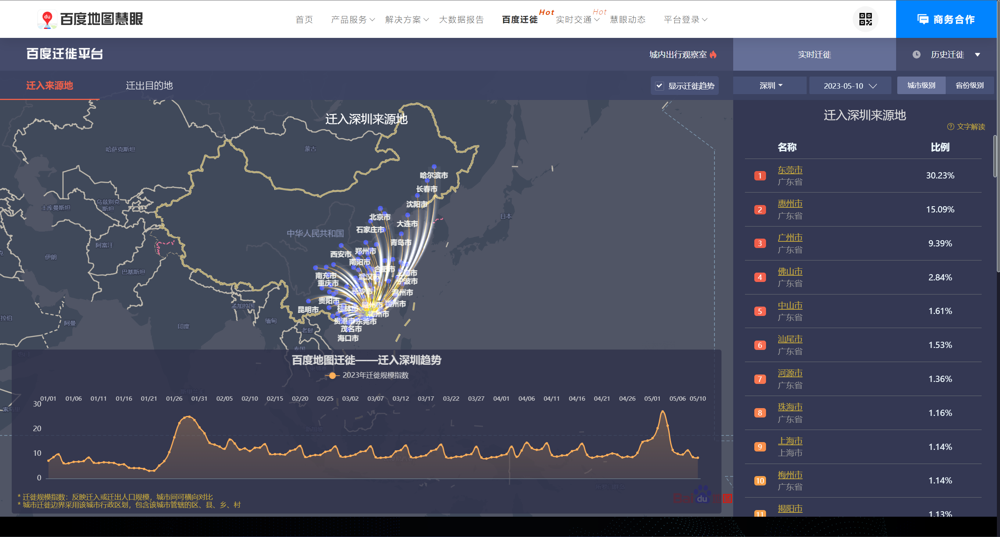

ENGLISH [中文版](./zh-cn.md)

# bd_qianxiCrawler

## All retrievable data from Baidu Migration:

- 🏙 Baidu migration data crawling 🏙
- 🏙 Overall city migration index 🏙
- 🏙 Inter-city migration index 🏙
- 🏙 Migration in and out of a specific city 🏙
- 🏙 Intra-city commuting index 🏙
- 🏙 Intra-city leisure and entertainment index 🏙
- 🏙 Overall travel intensity within a city 🏙
- ⌚ Accurate to city and specific date ⌚
- 💻 Time series analysis, city travel, traffic prediction 💻

## Current features

- Crawling historical migration in and out index of specific cities (20190112-now) (Comparison between cities is possible)

- Crawling city migration in and out rankings and proportions (e.g., 20230307 Shenzhen-Beijing 0.37) (Comparison between cities is not possible)

- Calculating city migration in and out index (e.g., 20230307 Shenzhen-Beijing 11.23, comparison between cities is possible) (Calculation based on the above two data)

- Crawling historical intra-city travel intensity index of specific cities (20200104-now)

- Crawling historical commuting travel intensity index of specific cities (20210122-now)

- Crawling historical leisure and entertainment travel intensity index of specific cities (20210122-now)

## Usage instructions:

> 2024.04.01update: only specific period available through the platform, sorry to hear that.

- Modify settings in settings.py:

  - Data scale: 'city'
  - City/Province name: 'Shenzhen' (taken from ./cities/ChineseAdminiDivisionsDict.py)
  - City/Province code: Obtain through get_city_code | get_province_code (can be directly referenced from ChineseAdminiDivisionsDict.py)
  - Migration direction: 'move_in' | 'move_out' (must choose one)
  - Target research date: '20230326' (used for calculating inter-city migration on a specific day, does not affect historical migration index of specific cities)

- Run main.py, data will be automatically exported to the data folder.

## Concat:

For any questions, please contact kingsleyl0107@gmail.com
